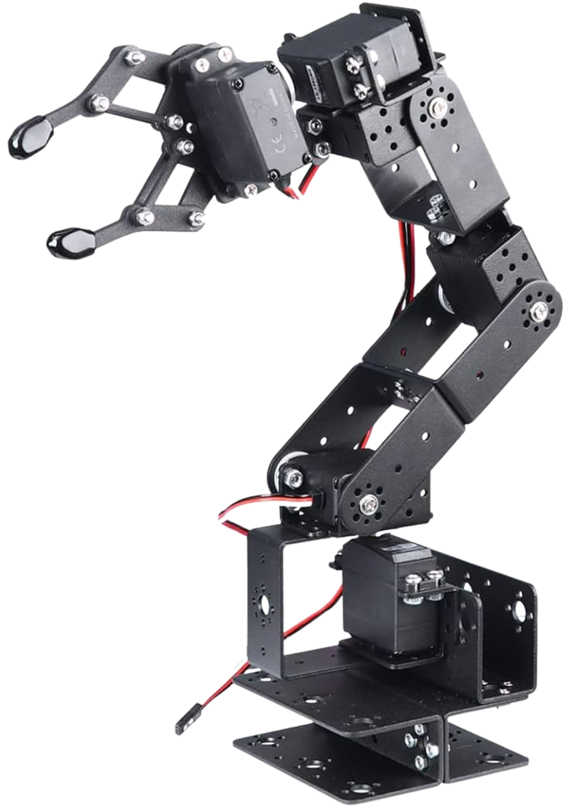

# ROT3U Robotic Arm - 5-DOF + 1 Gripper Kinematics

A comprehensive Python application for controlling and simulating the ROT3U robotic arm, featuring forward/inverse kinematics, trajectory planning, and real-time visualization.



## 🚀 Features

- ✅ **Forward Kinematics**: Calculate end-effector position from joint angles
- ✅ **Inverse Kinematics**: Calculate joint angles from target positions
- ✅ **Real-time Visualization**: 2D plotting of robot configurations
- ✅ **Arduino Integration**: Hardware control and communication
- ✅ **Trajectory Planning**: Smooth path generation between waypoints
- ✅ **Modern GUI**: User-friendly interface built with CustomTkinter
- ✅ **Workspace Analysis**: Reachability and collision detection
- ✅ **Multiple Solutions**: Elbow-up and elbow-down configurations

## 📋 Requirements

### Software Requirements
- Python 3.8 or higher
- pip (Python package installer)

### Core Dependencies
- NumPy (numerical computations)
- Matplotlib (visualization)
- CustomTkinter (modern GUI)
- PySerial (Arduino communication)

### Optional Dependencies
- roboticstoolbox-python (advanced trajectory planning - fallback available)
- spatialmath-python (3D spatial transformations)
- OpenCV (computer vision features)
- Jupyter notebook (development environment)

### Hardware Requirements (Optional)
- ROT3U Robotic Arm
- 6x Servo Motors (5-DOF + 1 gripper)
- Arduino Uno or compatible
- USB cable for Arduino connection
- Power supply for servos

## 🛠️ Installation

1. **Clone the repository:**
   ```bash
   git clone https://github.com/jaysh/5-1DOF_kinematics.git
   cd 5-1DOF_kinematics
   ```

2. **Install Python dependencies:**
   
   **Option A - Minimal installation (recommended):**
   ```bash
   pip install -r requirements_minimal.txt
   ```
   
   **Option B - Full installation with optional features:**
   ```bash
   pip install -r requirements.txt
   ```
   
   **Note**: The minimal installation includes only essential dependencies. 
   Optional dependencies in `requirements.txt` are commented out - 
   uncomment them if you need advanced features like roboticstoolbox.

3. **Run the application:**
   ```bash
   python code/main.py
   ```

## 🎯 Usage

### Starting the Application

```bash
cd code
python main.py
```

For help and command-line options:
```bash
python main.py --help
```

### GUI Interface

The application provides three main tabs:

#### 1. Forward Kinematics Tab
- **Input**: Joint angles in degrees for each servo
- **Output**: End-effector position (X, Y, Z) in centimeters
- **Features**: 
  - Real-time angle validation
  - Joint limit indicators
  - Workspace information

#### 2. Inverse Kinematics Tab
- **Input**: Target position (X, Y, Z) and orientation (Phi)
- **Output**: Required joint angles with visualization
- **Features**:
  - Multiple solution display
  - Forward kinematics verification
  - 2D robot arm plotting
  - Reachability checking

#### 3. Settings Tab
- **Configuration**: COM port, baud rate, servo mode
- **Arduino Communication**: Connection management
- **Servo Modes**: Sequential or simultaneous movement

### Hardware Setup

1. **Arduino Wiring:**
   - Connect servos to Arduino PWM pins
   - Ensure proper power supply for servos
   - Upload compatible firmware to Arduino

2. **Communication Settings:**
   - **Linux**: Default port `/dev/ttyACM0`
   - **Windows**: Use `COM3`, `COM4`, etc.
   - **Baud Rate**: 9600 (default)

3. **Servo Configuration:**
   - Joint limits are predefined but can be modified
   - Servo angles range from 0° to 180°

## 🤖 Robot Specifications

### Kinematic Parameters
- **Link 1 (Shoulder to Elbow)**: 10.5 cm
- **Link 2 (Elbow to Wrist)**: 10.0 cm  
- **Link 3 (Wrist to End-Effector)**: 16.8 cm

### Joint Limits
| Joint | Name | Range (degrees) |
|-------|------|-----------------|
| 0 | Base Rotation | 0° - 180° |
| 1 | Shoulder Pitch | 0° - 180° |
| 2 | Elbow Pitch | 0° - 180° |
| 3 | Wrist Pitch | 0° - 150° |
| 4 | Wrist Roll | 0° - 180° |
| 5 | Gripper | 0° - 180° |

### Workspace
- **Maximum Reach**: ~37.3 cm
- **Minimum Reach**: ~0.5 cm
- **Working Height**: -37.3 cm to +37.3 cm

## 📁 Project Structure

```
5-1DOF_kinematics/
├── code/                          # Main application code
│   ├── kinematics/
│   │   ├── __init__.py
│   │   └── Kinematics.py         # Core kinematics algorithms
│   ├── GUI/
│   │   ├── __init__.py
│   │   ├── gui.py                # Main GUI application
│   │   ├── functions.py          # GUI support functions
│   │   └── responses.py          # Error messages
│   ├── Module3.py                # Trajectory generation utilities
│   ├── main.py                   # Application entry point
│   └── robot.ipynb               # Jupyter notebook for analysis
├── src/                          # Arduino firmware
│   └── testCode.cpp              # Arduino control code
├── docs/                         # Documentation
├── testdata/                     # Test data and examples
├── requirements.txt              # Python dependencies
└── README.md                     # This file
```

## 🔧 Development

### Code Structure

The project follows a modular architecture:

- **`Kinematics.py`**: Core robotics algorithms with DH parameters
- **`gui.py`**: Modern GUI using CustomTkinter
- **`Module3.py`**: Trajectory planning and utility functions
- **`functions.py`**: Arduino communication and validation

### Key Classes

#### `Kinematic` Class
```python
from kinematics.Kinematics import Kinematic

# Initialize kinematics
robot = Kinematic()

# Forward kinematics
joint_angles = [0, 45, 90, 45, 0, 0]  # degrees
transform = robot.forward_kinematics([math.radians(a) for a in joint_angles])

# Inverse kinematics
target_pos = [15, 0, 20]  # cm
solutions = robot.inverse_kinematics(target_pos)
```

### Testing

Run the Jupyter notebook for interactive testing:
```bash
jupyter notebook code/robot.ipynb
```

## 🔌 Arduino Communication Protocol

### Command Format
```
angle1,angle2,angle3,angle4,angle5,angle6,mode\n
```

- **angles**: Servo angles in degrees
- **mode**: `s` for sequential, `c` for concurrent movement

### Example Commands
```
90,45,135,90,0,45,s\n    # Sequential movement
0,90,90,45,180,0,c\n     # Concurrent movement
STOP\n                   # Emergency stop
STATUS\n                 # Request status
```

## 🎓 Educational Use

This project is excellent for learning:

- **Robotics Fundamentals**: Forward/inverse kinematics, DH parameters
- **Python Programming**: GUI development, scientific computing
- **Mathematics**: Linear algebra, trigonometry, coordinate transformations
- **Hardware Integration**: Arduino programming, servo control

### Academic Applications
- Robotics courses and laboratories
- Control systems education  
- Computer science projects
- Engineering design challenges

## 🐛 Troubleshooting

### Common Issues

1. **Import Errors**
   ```bash
   pip install -r requirements.txt
   ```

2. **Arduino Connection Failed**
   - Check COM port in Settings tab
   - Verify Arduino is connected and powered
   - Ensure correct drivers are installed

3. **No Solution Found**
   - Target position may be outside workspace
   - Check joint limits and constraints
   - Try different orientations (phi angle)

4. **GUI Display Issues**
   - Update graphics drivers
   - Try different matplotlib backends
   - Check display scaling settings

### Debug Mode
Enable verbose logging by modifying `main.py`:
```python
import logging
logging.basicConfig(level=logging.DEBUG)
```

## 📚 References

- [Denavit-Hartenberg Parameters](https://en.wikipedia.org/wiki/Denavit%E2%80%93Hartenberg_parameters)
- [Inverse Kinematics Methods](https://en.wikipedia.org/wiki/Inverse_kinematics)
- [Robotics Toolbox Documentation](https://petercorke.github.io/robotics-toolbox-python/)
- [ROT3U Design Files](https://www.thingiverse.com/thing:1015238)

## 👥 Team Members (The Cartesian Choreographers)

-  Lead Developer & Project Manager -**Jaysh Khan** 
- Mathematical Implementation and testing - **Zain ul Abideen**, **Syed Furqan Ali**,**Rana Talal Ahmed** 

## 📄 License

This project is open source. See the LICENSE file for details.

## 🤝 Contributing

Contributions are welcome! Please feel free to submit a Pull Request.

### Areas for Contribution
- [ ] 3D visualization improvements
- [ ] Additional trajectory planning algorithms
- [ ] Mobile app development
- [ ] Advanced collision detection
- [ ] Machine learning integration
- [ ] Documentation improvements

## 📈 Future Enhancements

- [ ] **3D Visualization**: Full 3D robot model rendering
- [ ] **Simulation**: Virtual robot environment
- [ ] **Path Planning**: Obstacle avoidance algorithms
- [ ] **ROS Integration**: Robot Operating System compatibility
- [ ] **Computer Vision**: Camera-based control
- [ ] **Machine Learning**: Automated trajectory optimization

---

**Happy Coding! 🚀**

For questions or support, please open an issue on GitHub or contact the development team.
